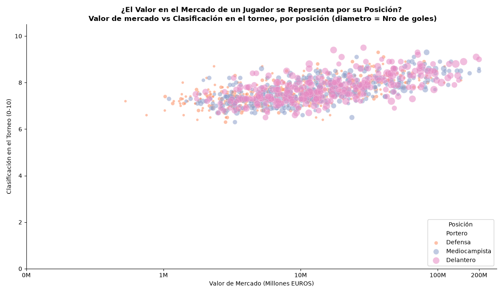
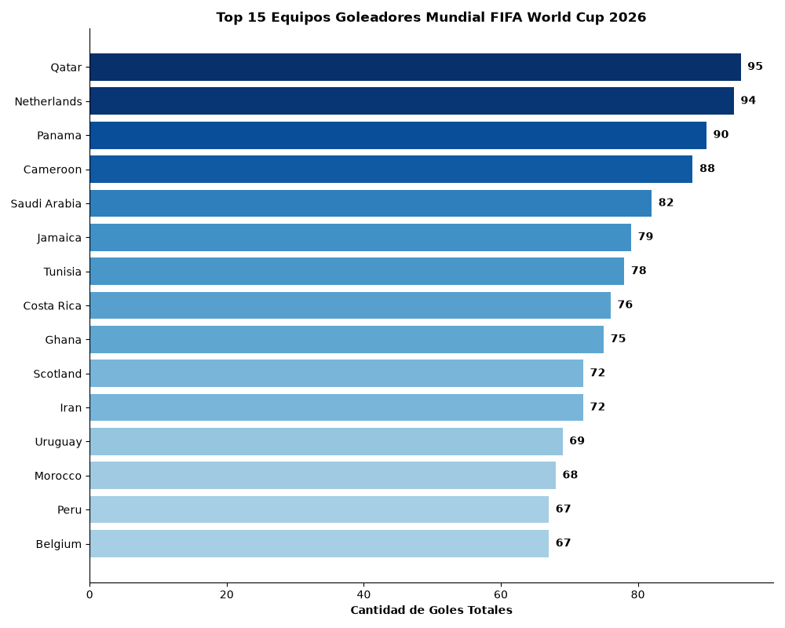

# Vizualización de datos

## Actividad #2  Visualización estática con toma de decisiones de diseño `(Matplotlib/Seaborn)`

### Competencias

Modelar problemas reales con herramientas estadísticas y algorítmicas usando lenguajes
de programación y herramientas profesionales de ciencia de datos que conduzcan a la
comprensión del funcionamiento de un sistema y el delineamiento de posibles
trayectorias a futuro   

### Proposito 
``` python
Propósito: que el estudiante aplique de forma integrada los fundamentos de comunicación visual de datos y la visualización estática en Python, justificando decisiones de diseño según propósito y audiencia, y evitando errores comunes o prácticas engañosas.
 ```

### Intergrantes 

- [Yeison David Toro] (https://github.com/YEISON-TORO11) 

``` text
Roles:
- Diseñador visual
- revisor de calidad 
```
- [Juan Sebastian Ulloa] (https://github.com/JuSeUlloa)

``` text
Roles:
- analista 
- Diseñador visual
```


### Desarollo 

Paso a paso:

1.	Conjunto de datos de Rendimiento de jugadores de la Copa Mundial de la FIFA 2026  (público)
Link acceso : [fifa-world-cup-2026-player-performance-dataset](https://www.kaggle.com/datasets/rauffauzanrambe/fifa-world-cup-2026-player-performance-dataset/data)

Descripción:  El conjunto de datos generado con IA, incluye atributos de los jugadores, registros de participación en partidos, goles, asistencias, tiros, precisión de pases, acciones defensivas, estadísticas de porteros, registros disciplinarios, indicadores de rendimiento físico y métricas analíticas avanzadas. Estos datos permiten a los usuarios evaluar la efectividad de los jugadores, comparar los atletas en todas las posiciones, identificar talentos emergentes y analizar tendencias tácticas durante el torneo.

2. Codigo de visualización
### codigo github: [actividad.py](./entregables/actividad_2_visualizacion.py)

3. La visualización será exploratoria (descubrir patrones, outliers, relaciones) 

4. Definir audiencia y contexto (obligatorio). 
La audiencia se enfoca en investigadores, científicos de datos, analistas de fútbol, estudiantes y entusiastas del deporte pueden utilizar las visualizaciones de datos para explorar relaciones, correlaciones y patrones para medir el. rendimiento tanto a nivel de jugador como de equipo.

5. Graficos:
Diagrama de dispersion siendo una visualizacion ideal para representar variables cuantitativas continuas, con el fin de explorar relaciones, correlaciones o patrones que existan entre las variables numericas.

### Ilustración 1. Diagrama de dispersión  Valor mercado Vs Clasificación en el torneo por posición.


 
 
6. Diseñar la codificación visual:
    -	Posicion X : market_value_eur (valor del jugador en el mercado unidad de medida Euros) variable cuantitativa se aplica logaridmo para reducir la escala.
    -	Posicion Y: tournament_raiting (Clasificacion del jugador durante el torneo, se aplica condicion para los que contengan mas de 90 minutos jugados) variable cuantitativa. 
    -	Color: position (Posicion que ocupa dentro del campo de futbol) variable categorica.
    -	Tamaño: total_goals_tournament (total de goles en el torneo) variable cuantitativa se quiere visualizar la representatividad del jugador con la posicion y la cantidad de goles.
    -	Forma: No se aplica variables adicionales para evitar saturaciones en el diagrama. 

7. Aplicar legibilidad y jerarquía:
    -	Título orientado al mensaje: se plantea una pregunta exploratoria ¿El Valor en el Mercado de un Jugador se Representa por su Posición?, que resume el allazgo encotrado dentro de la visualizacion. 
    -	Etiquetas y unidades claras: Eje X valor del jugador unidades en euros, eje Y clasificacion del jugador en el torneo unidades numerica (0-10).
    -	Contraste y ordenamiento: se aplica un fondo blanco, con puntos que cuentan con un borde detallado, aplicación de transparencia lo que reduce la ocultacion, adicion de leyenda en la parte inferior-derecha del grafico con las posiciones usadas en el terreno de juego.   
    -	Reducción de carga cognitiva: se aplico un filtro a los jugadores que tuviesen 90 o mas minutos jugados a los cuales les aplicaria la clasificacion, no se aplicaron etiquetas sobre sobre los puntos con el fin de evitar el ruido visual, asi mismo se aplico una escala logaridmica sobre la variable x para evitar colapsos en el eje debido a los valores bajos. 

8. Definir color y estilo:
    -	Criterio de paleta: se aplico la paleta set2 tonos diferenciados y suabes para contrastar.
    -	Consistencia de colores y símbolos: la aplicación de la paleta set2 en la variable position manteniendo la asociacion de color-categoria. 
    -	Consideraciones básicas de accesibilidad: aplicar set2 aplica tonalidades color pastel lo que permite en el fondo de color blanco realizar un contraste y evita las combinaciones de colores rojo-verde para condiciones de daltonismo.
9. Chequeo ético (obligatorio). Verificar y declarar:
    -	El eje y parte del valor 0 a 10 lo que no permite exagerar diferencias en las clasificaciones de los jugadores.
    -	 El grafico se aplica en dos dimensiones sin sombras ni efectos 3D.
    -	Se aplica el filtro de que se representen los jugadores que cuenten con 90 o mas minutos jugados debido que aplicar la escala sobre jugadores que tengan 5 o 10 minutos representarian clasificaciones bajas o muy altas que se no representarian el verdadero nivel del jugador.  

### Ilustración 2. Diagrama de barras horizontal top 15 equipos goleadores mundial.



6.	Diseñar la codificación visual:
    -	Posicion X : goles_x_equipo (agrupacion de goles por selección participante) variable cuantitativa.
    -	Posicion Y: team (Nombre del equipo) variable categorica , encargada de la lectura de las etiquetas de las barras horizontales. 
    -	Color: goles_x_equipo toma tonos mas oscuros en las mayores cantidades de goles y tonos mas degradados a medida que disminuyen la cantidad.
    -	Tamaño: No se aplica variables adicionales para evitar saturaciones en el diagrama.
    -	Forma: No se aplica variables adicionales para evitar saturaciones en el diagrama. 

7.	Aplicar legibilidad y jerarquía:
    -	Título orientado al mensaje: se plantea una descripcion entorno a los datos que se muestran y el torneo de donde provienen los datos.

    -	Etiquetas y unidades claras: Eje X cantidad de goles totales valores representados al final de cada una de las barras eliminando la necesidad de estimar los valores por el eje.
    -	Contraste y ordenamiento: se aplico un agrupamiento de los goles por selección y se ordenaron de manera decendente para visualizar las cantidades de mayor a menor para un recorrido visual de acuerdo con las tonalidades oscuras-claras.   
    -	Reducción de carga cognitiva: Se cargaron las 15 selecciones con mas goles con el fin de evitar ruido visual, no se aplico etiqueta en el eje y ya que los nombres de las selecciones son autoexplicativos. 

8.	Definir color y estilo:
    -	Criterio de paleta: se aplico la paleta secuencial blues para una variable cuantitativa como son los goles, para valores mas altos los tonos oscuros guiando la atencion para los equipos que son lideres en la cantidad de goles. 
    -	Consistencia de colores y símbolos: se aplica una paleta monocromatica que aporta con el fondo y estilo del diagrama. 
    -	Consideraciones básicas de accesibilidad: aplicar una escala de azules es uniforme y funciona para condiciones de daltonismo, adicional se adicionan al final de la barra la cantidad de goles en la estimacion sobre el eje. 
9.	Chequeo ético (obligatorio). Verificar y declarar:

    -	El eje X parte del valor 0  lo que no permite exagerar diferencias entre las cantidades de goles genereados por las selecciones dentro del torneo.
    -	El grafico se aplica en dos dimensiones sin sombras ni efectos 3D.
    -	Se declara la eleccion de las 15 mejores selecciones resaltado en el titulo,  mostrar la totalidad de las selecciones sacrifica la legibilidad que no aportara mayor informacion al grafico.
